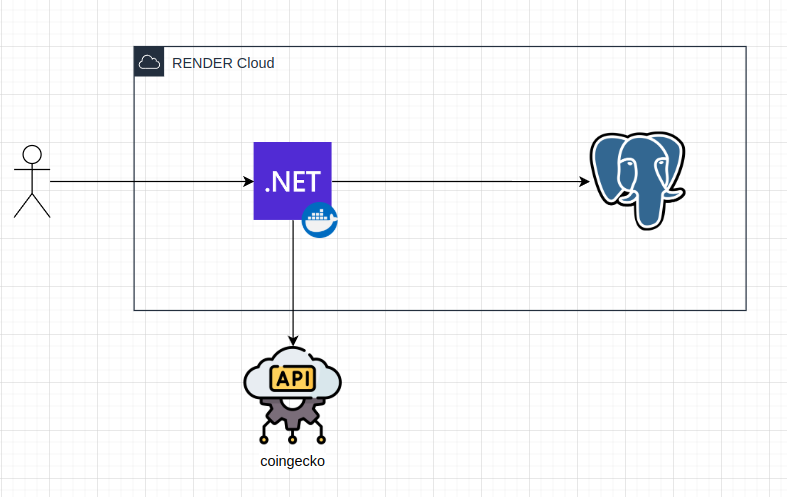

# 🤖 WiseBuddy API

> **Assistente Virtual Inteligente para Consultoria de Investimentos**
> 
> API RESTful completa que oferece análise de perfil do investidor (suitability), recomendações personalizadas baseadas
---

## 🎯 **Funcionalidades Principais**

### 🔍 **Sistema de Suitability**
- ✅ Questionário padronizado ANBIMA com 8 perguntas
- ✅ Cálculo automático de perfil (Conservador/Moderado/Agressivo)
- ✅ Histórico completo de testes e evolução do perfil
- ✅ Auditoria detalhada de respostas para compliance

### 💡 **Motor de Recomendações**
- ✅ Recomendações personalizadas baseadas no perfil
- ✅ Portfólio diversificado por classe de ativo
- ✅ Exportação de relatórios (JSON/TXT)
- ✅ Atualização automática conforme mudança de perfil

### 👥 **Gestão de Usuários**
- ✅ CRUD completo de usuários
- ✅ Relacionamento com suitability e recomendações
- ✅ Soft delete para preservar histórico

### 💹 **Consulta de Cotações de Criptomoedas**
- ✅ Endpoint para consultar preços de mercado de criptomoedas
- ✅ Cache em memória de 5 minutos para evitar bloqueios da API externa

---
---

## 🏗️ **Arquitetura & Tecnologias**



### **Stack Principal**
- **[.NET 9](https://dotnet.microsoft.com/)** - Framework moderno e performático
- **[Entity Framework Core 9](https://learn.microsoft.com/ef/)** - ORM com suporte completo ao PostgreSQL
- **[PostgreSQL 15](https://www.postgresql.org/)** - Banco de dados robusto e confiável
---

## 📁 **Estrutura do Projeto**

```
WiseBuddy.Api/
├── 📂 Controllers/              # 🎮 Endpoints REST da API
├── 📂 Models/                   # 🏗️ Entidades do banco de dados
├── 📂 DTOs/                    # 📤 Data Transfer Objects
├── 📂 Data/                    # 🗄️ Camada de dados
├── 📂 Services/                # 🧠 Lógica de negócio
├── 📂 Helpers/                 # 🛠️ Classes auxiliares
├── 📂 Migrations/              # 📋 Versionamento do banco
├── 📄 Program.cs               # ⚙️ Configuração da aplicação
├── 📄 appsettings.json         # 🔧 Configurações do ambiente
├── 📄 docker-compose.yml       # 🐳 Orquestração de containers
```

---

## 🐳 **Setup com Docker**

### **1. Pré-requisitos**
```bash
# Verificar se Docker está instalado
docker --version
docker-compose --version
```

### **2. Subir a Infraestrutura**
```bash
# Clonar o repositório
git clone <url-do-repositorio>
cd WiseBuddy.Api

# Subir PostgreSQL + PgAdmin
docker-compose up -d

# Verificar se os serviços estão rodando
docker-compose ps
```

---

## ⚙️ **Configuração e Execução Local**

### **1. Instalar Ferramentas**
```bash
# Instalar .NET 9 SDK
# https://dotnet.microsoft.com/download

# Instalar Entity Framework CLI
dotnet tool install --global dotnet-ef --version 9.0.0
```

### **2. Definir Variável de Ambiente**
Para que o endpoint de cotações funcione corretamente, você precisa definir a variável de ambiente contendo sua **API Key** da CoinGecko.

- **Nome da variável:** `API_KEY`  
- **Valor:** sua chave da API (exemplo: `pldasd`)

#### **Exemplo no Linux/macOS (bash/zsh)**
```bash
export API_KEY=pldasd
```

### **3. Configurar Banco de Dados**
```bash
# Navegar para o projeto
cd WiseBuddy.Api

# Restaurar dependências
dotnet restore

# Aplicar migrations
dotnet ef database update
```

### **4. Executar a Aplicação**
```bash
# Desenvolvimento
dotnet run

# Produção
dotnet run --configuration Release

# Com hot reload
dotnet watch run
```

### **5. Verificar Funcionamento**
- **API**: http://localhost:5000
- **Swagger**: http://localhost:5000/swagger

---

## 📊 **Fluxo de Uso da API**

### **1. 📋 Obter Questionário**
```http
GET /api/suitability/questionario
```
Retorna as 8 perguntas padrão ANBIMA com opções de resposta.

### **2. 🧪 Realizar Teste de Suitability**
```http
POST /api/suitability
{
  "usuarioId": 1,
  "rendaMensal": 8000.00,
  "idadeInvestidor": 35,
  "tempoInvestimento": 10,
  "objetivoInvestimento": "Aposentadoria",
  "respostas": [
    {
      "perguntaId": 1,
      "respostaSelecionada": "Experiência moderada (fundos/tesouro)"
    }
    // ... 7 outras respostas
  ]
}
```

### **3. 🎯 Gerar Recomendações**
```http
POST /api/recomendacoes/generate/1
```
Sistema analisa o perfil e gera portfólio personalizado.

### **4. 📄 Exportar Relatórios**
```http
GET /api/recomendacoes/usuario/1/export/json
GET /api/recomendacoes/usuario/1/export/txt
```

---

## 📈 **Exemplos de Resposta da API**

### **Resultado do Suitability**
```json
{
  "id": 123,
  "usuarioId": 1,
  "perfilInvestidor": "Moderado",
  "pontuacaoTotal": 24,
  "rendaMensal": 8000.00,
  "objetivoInvestimento": "Aposentadoria",
  "dataTeste": "2024-01-15T10:30:00Z",
  "descricaoPerfil": "Busca equilíbrio entre segurança e rentabilidade...",
  "respostas": [
    {
      "perguntaId": 1,
      "pergunta": "Qual é a sua experiência com investimentos?",
      "respostaSelecionada": "Experiência moderada (fundos/tesouro)",
      "pontuacaoObtida": 3
    }
  ]
}
```

### **Recomendações Geradas**
```json
[
  {
    "tipoAtivo": "Tesouro IPCA+",
    "descricao": "Título público indexado à inflação, protege o poder de compra.",
    "percentualSugerido": 25.00,
    "rentabilidadeEsperada": 12.50,
    "nivelRisco": "Médio",
    "ativa": true
  },
  {
    "tipoAtivo": "Fundos Multimercado",
    "descricao": "Fundos com estratégias diversificadas, gestão ativa profissional.",
    "percentualSugerido": 30.00,
    "rentabilidadeEsperada": 14.00,
    "nivelRisco": "Médio",
    "ativa": true
  }
]
```
---

## 📚 **Documentação Adicional**

### **Swagger/OpenAPI**
- Acesse `/swagger` para documentação interativa completa
- Todos os endpoints documentados com exemplos
- Schemas detalhados para request/response

### **Banco de Dados**
- **Migrations**: Versionamento automático do schema
- **Seed Data**: Dados iniciais para desenvolvimento
- **Indices**: Otimizações para queries frequentes

#
## 👥 **Integrantes**

| Nome | RM | 
|------|-----|
| **Caíque Walter Silva** | RM550693
| **Carlos Eduardo Caramante Ribeiro** | RM552159
| **Felipe Heilmann Marques** | RM551026
| **Guilherme Nobre Bernardo** | RM98604
| **Matheus José de Lima Costa** | RM551157

---
